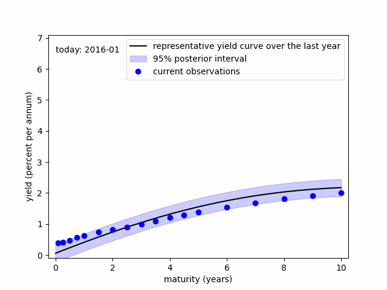

[Curriculum Vitae(CV)](https://github.com/econPreference/econPreference.github.io/blob/master/CV.pdf)

> 
>
> - dynamic changes in the US government yield curve over the recent years
> - "representative yield curve over the last year" and "95% posterior interval" are derived from [the Gaussian Process(GP) model](https://github.com/econPreference/econPreference.github.io/blob/master/about_code.py).
> - raw data source: [Filipović et al. 2022](https://www.discount-bond-data.org)

## Research Interests

(Bayesian) Machine Learning, Asset Pricing, Monetary Policy, Macroeconometrics

## Packages

- [bayecon.matlab](https://github.com/econPreference/bayecon.matlab): user-friendly Bayesian econometrics Matlab toolbox that does not require users to write a script. It is really easy to use!

## Working Papers

- "Regime-Switching Macro Risks in the Term Structure of Interest Rates", with Kyu Ho Kang, under review\
  [[paper]](https://papers.ssrn.com/sol3/papers.cfm?abstract_id=4414404), [[my post]](https://econpreference.github.io/RSmacro/)
- "Global Factors in Inflation and Interest Rates", with Kyu Ho Kang, under revision\
  [[paper]](https://papers.ssrn.com/sol3/papers.cfm?abstract_id=3874405)

## Publications

in Korean

- “Analysis of the Regime-Switching Property of Unspanned Macro Risks in the Korean Yield Curve”, 2023, Economic Analysis, Vol. 29(3), The Economic Research Institute of the Bank of Korea, pp. 1-34.\
  [[paper]](https://www.bok.or.kr/imer/bbs/P0000556/view.do?nttId=10079760&menuNo=500783&pageIndex=1)
